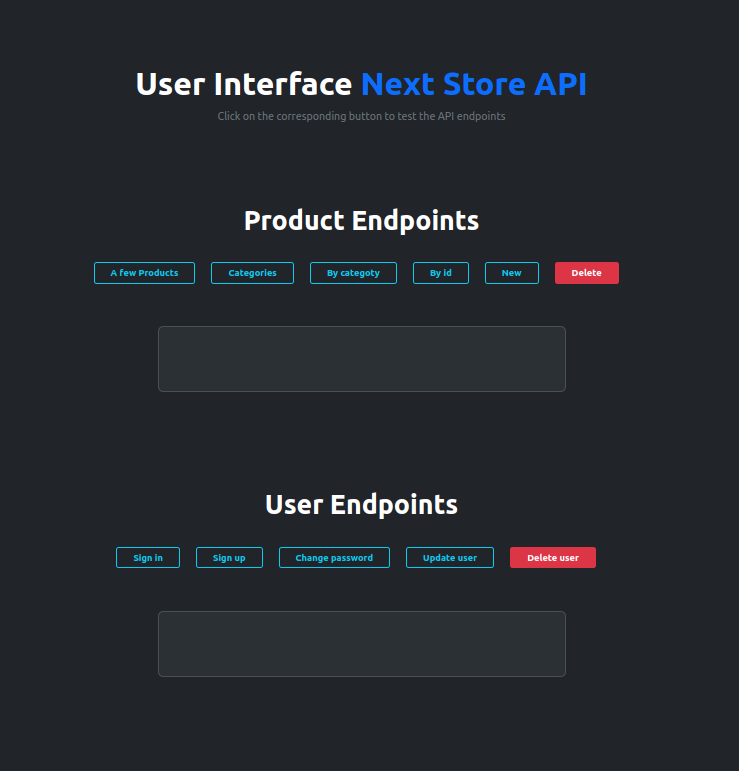
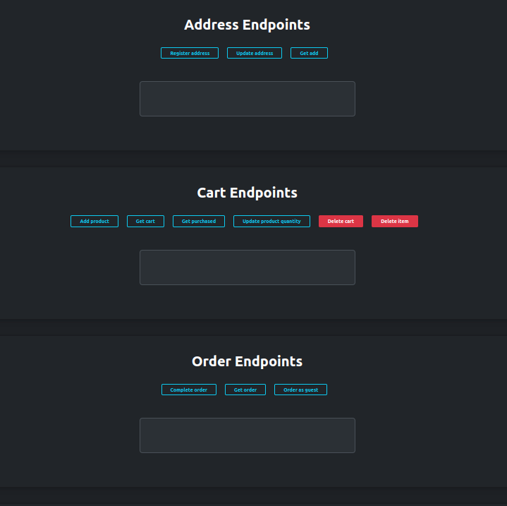
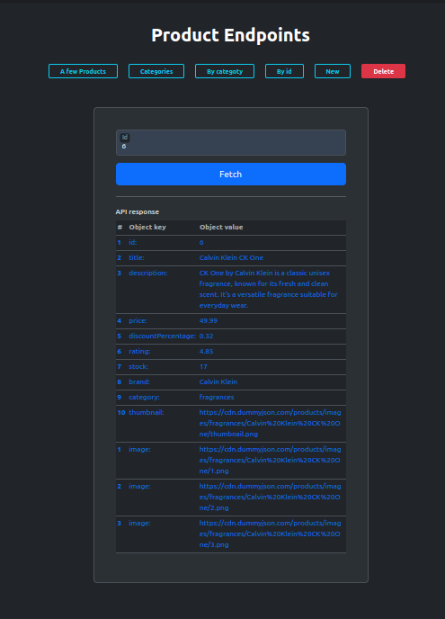
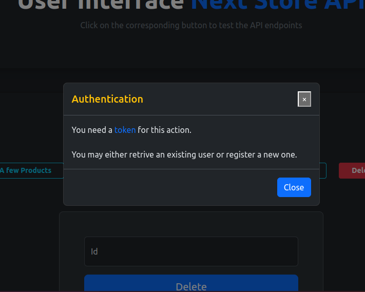
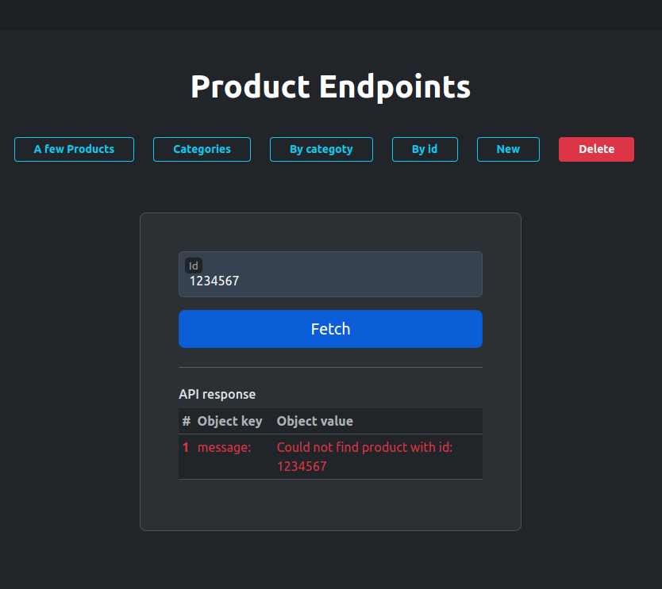
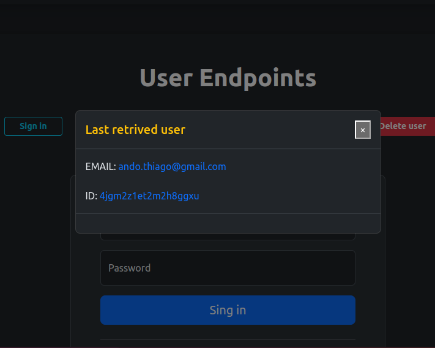
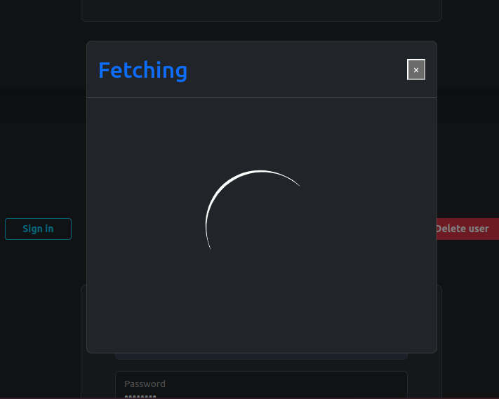
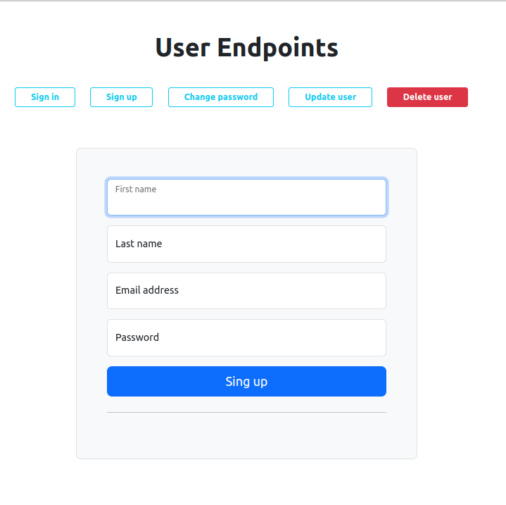
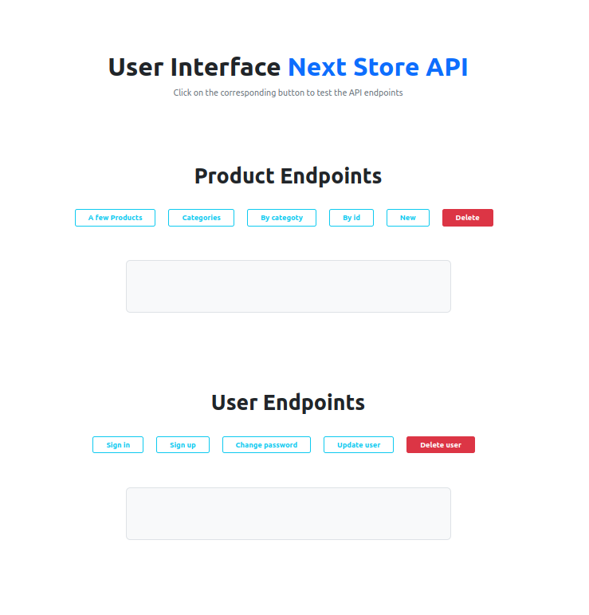

# User Interface to interact with Next-store-API

This website is part of a backend project called <a href="https://github.com/ThiagoAndo/Next-Store-API.git">Next-store-API</a> which is built with Node.js. The project includes API documentation, a Postman collection, and this website. You can easily understand how to use all the routes provided by the Next-store-API by simply reading the documentation and using Postman to make requests. However, it's certainly more intuitive to have a real user interface to make requests and understand the dynamics of the backend, which is why this website was built.

If you would like to check a real e-commerce website which uses Next-tore-API as backend go to this repository <a href="https://github.com/ThiagoAndo/Store-e-commerce.git">Store-e-commerce</a>:

 

## Table of contents

- [Overview](#overview)

  - [Built with](#built-with)
  - [Screenshot](#screenshot)

- [Author and links](#author)
  - [Alive website](#author)
     

## Built with

- Semantic HTML5 markup
- Bootstrap
- Java Script Modules

## Overview

Users should be able to:

- Register, retrive, delete and update a users' data.
- Get a sample of the product data, all product categories, a product by its ID, and also register or delete a product.
- Register, retrive, update and delete a users' cart.
- Register and retrive an invoice of user and also register an invoice for a guest user.
- Toggle the color scheme between light and dark mode.

 

### Screenshot

 

 

    

 

     

 

 

      

 

       

 

       

 

       

 

       

 

       

 

      

 

## Author

- Github - [Thiago Ando de Freitas](https://github.com/ThiagoAndo)
- Personal website - [Portfolio](https://thiago-freitas-portfolio.vercel.app/)
- Alive website - [UI-Next-store-API](https://next-store-api-62m2.onrender.com/userInterface) - Note : You may
 experience a delay in server response on your first request due to the free hosting service
  provided by RENDER.

 

<h5 style="color:black;">"The impediment to action advances action. What stands in the way becomes the way"</h5>
<h5 style="color:black;">Marcus Aurelius </h5>

